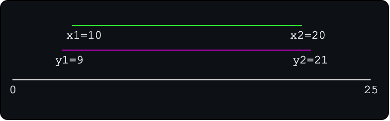

# Day 4 Part A - Solution

This problem mainly depends on your ability to parse input data that is slightly more advanced, however if you are familiar with the `split()` function in python it shouldn't be a game changer. However, new programmers will probably struggle with determining how to check if one range is contained within another. All these points of potential contention in solving the problem are explained below!

Simply run the script and view the terminal's output to view the answer. However, make sure that 
`FILE_MODE_REAL_INPUT_MODE` is set to true if you want to run the script against the problem input data the AOC challenge 
expects you to solve. Setting it to false will run the script against the contents of `test.txt` which is a 
test case presented in the problem itself. 

## Problem Difficulty (1-10)

3/10

## Solution Explanation

### Parsing Input Data

So this time around the AOC challenge stepped their game up when it comes to the format of these input files. The format
of the file this time around was much more complicated to parse but nonetheless if you are familiar with string 
manipulation it shouldn't have been a game changer.

Lets examine the structure of the file to determine our parsing method. 

The file contains lines in the following form: `A-B,X-Y` where `A,B,C,D` are all integers. What we need to do is 
find a way to extract these values from the presented string. 

So first thing first is that the comma denotes the separation of pairs, so we can extract each range in the following
manner: `'A-B,X-Y'.split(',') == ['A-B', 'X-Y']` which is exactly what occurs on **line 10** of the solutions.

Then we need to extract the integer values from the ranges with the form `A-B` which can be simply done again using 
`split()` but this time using the dash as the seperator. So `'A-B'.split('-') == ['A', 'B']`. Which is what happens on
**line 13** of the solutions but note that I store the pairs now in the following form `(['A','B'], ['X', 'Y'])` which 
is just a tuple of arrays.

We have basically tackled the main monster here and all that is left is looping over these tuples and converting each 
element in the array to an integer by using `int()` before we can analyze these ranges.

### Checking Ranges Are Subsets

We now want to verify if one of the ranges is a subset of the other range presented in the pair. Assume we have the 
following pair of ranges `x1,x2 = 10,20` and `y1,y2 = 9,21`. If you look at **lines 20-23** this is exactly how our 
variables are structured before we start comparing them. 

Let's visualize these ranges to determine how can we determine if one is a subset of the other.

As we can see from the image, that a range is a subset of another if both of its start and endpoints are within
another range. For example, in the image the range `x` is a subset of `y` because the 
following condition holds true `y1 <= x1 <= x2 <= y2`. 

So we can derive the first test, which checks if the range `x` is contained within the range `y`. Note we can
similarly check if `y` is a subset of `x` with the following condition `x1 <= y1 <= y2 <= x2`.

These findings motivate the conditional statement on **line 26** of the solutions and everytime either condition holds true
we simply add one to the running total.

## Answer

The answer for this problem is *448*.

This answer is true for my given specialized input data. Note that every AOC user will not receive the
same input data for even the same problem.
